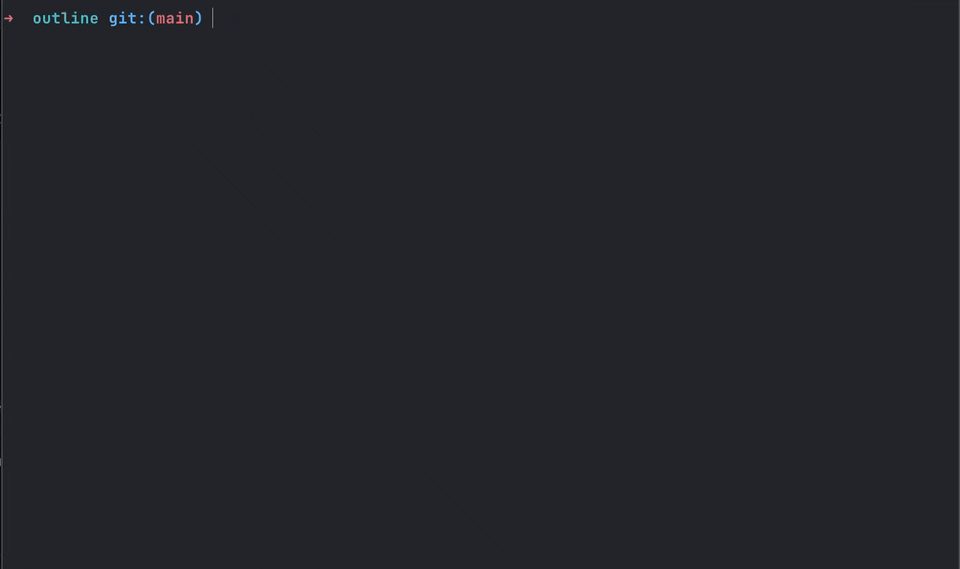

# Agento

A terminal CLI that scores how easy your repo is for AI agents and humans to understand, change, and trust. Run it in a repo to get an operability score, structural risks, and the highest-friction areas to fix first.



*Interactive health report in one pass.*

## Why Agento

Surfaces the kinds of problems that slow down both engineers and coding agents: oversized files, weak boundaries, missing docs and tests, generic naming, and high-coupling modules. Output is deterministic and terminal-native.

## Commands

- `agento health` — overall score (0–100), letter grades per section, interactive navigator (arrow keys + Enter)
- `agento health --summary` — full breakdown: weighted subscores, hotspots, task-friction warnings, recommended fixes
- `agento health --format json` — machine-readable for CI or scripts

## Install / Download 📦

### Option 1: Clone and run locally

```bash
git clone <your-repo-url>
cd agento
pnpm install
pnpm build
node ./dist/cli/index.js health
```

### Option 2: Link it as a local CLI

This makes `agento` available as a command on your machine during development.

```bash
pnpm install
pnpm build
pnpm link --global
agento health
```

### Option 3: Build a tarball

Useful for local distribution or release packaging.

```bash
pnpm package:tarball
```

This creates a package tarball like `agento-0.1.0.tgz`.

### Option 4: Homebrew formula generation

If you are preparing a release, you can generate a Homebrew formula after producing a tarball URL:

```bash
pnpm formula ./agento-0.1.0.tgz https://github.com/your-org/agento/releases/download/v0.1.0/agento-0.1.0.tgz
```

That writes [Formula/agento.rb](/Users/bray/planio/Formula/agento.rb).

## Usage 🚀

### Basic analysis

Run inside any repository:

```bash
agento health
```

Or without linking:

```bash
node ./dist/cli/index.js health
```

### JSON output

For CI, scripts, or machine-readable workflows:

```bash
agento health --format json
```

### Full summary

For the expanded report instead of the compact interactive overview:

```bash
agento health --summary
```

### Help

```bash
agento --help
```

## Example Output 🖥️

```text
+-----------------------------------+
| AGENTO AI OPERABILITY             |
| Score: 62/100 (Needs work) 🟠     |
+-----------------------------------+

Subscores
- Code Discoverability
- Context Density
- Architectural Legibility
- Blast Radius
- Change Safety
- Agent Taskability
- Documentation Surface

Task Friction Warnings
- No test framework detected
- No architecture documentation detected
- Large files increase patch risk
```

## Typical Uses 🛠️

- Audit a repo before handing it to Codex, Claude, or another coding agent
- Identify what makes AI edits risky before a sprint
- Add health checks to internal engineering workflows
- Track maintainability issues that make onboarding slower
- Create a shared quality language around structure, docs, and safety

## Local Development 👨‍💻

```bash
pnpm install
pnpm build
pnpm dev
```

Useful commands:

- `pnpm build` - Compile TypeScript to `dist/`
- `pnpm dev` - Run the CLI from source with `tsx`
- `pnpm health` - Alias for local health command execution
- `pnpm package:tarball` - Build and package the CLI
- `pnpm formula` - Generate a Homebrew formula

## Current Product Direction 🎯

Agento is intentionally focused on one primary wedge right now:

- A deterministic AI operability and repository health score

That means the emphasis today is on trustworthy scanning, clear terminal output, and actionable findings rather than AI-generated narration.

## Planned Next Steps 🗺️

Internal groundwork exists for future commands and config-driven workflows, but they are not public CLI commands yet.

Near-term direction:

- `agento init`
- `agento context --write`
- stricter architectural rules
- richer config support through `agento.json`
- more CI-friendly reporting
- add an “agent recommendation mode”
  - Prefer narrow tasks against isolated components
  - Avoid asking agents to “refactor navigation” in one shot
  - For form work, first ask the agent to map field definitions and validation boundaries
  - For root-shell changes, force a plan-first workflow before edits
- Taskability Assessment
- Recommended AI Working Style

## What Agento Looks For ✅

Current health categories:

- Code Discoverability
- Context Density
- Architectural Legibility
- Blast Radius
- Change Safety
- Agent Taskability
- Documentation Surface

## Philosophy

Agento is not trying to replace general AI assistants.

It is meant to complement them:

- Codex helps you work in a repository
- Agento helps you understand whether that repository is easy to work in, why it is not, and what to fix first

## License

MIT
